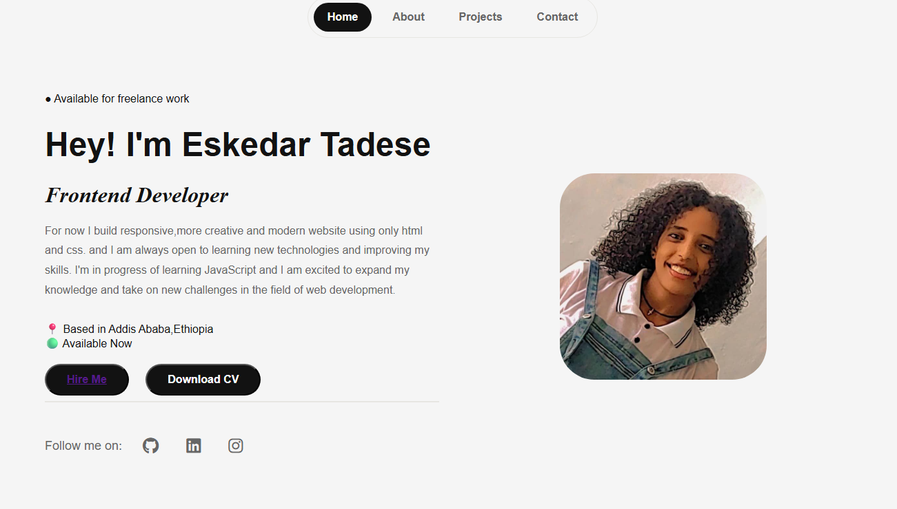

# personal-landing-page
Thiis is my personal landing page built only using html and css.the goal was to practice flexbos,layout structuring and responsive design.

## Technologies used
    -HTML
    _CSS
    _Font Awesome
## Screenshot
    

## What I Learned
In this project i learned how to structure a webpage using html and css more on semantic elements that define the different parts of a web page like header,section,navigation....element.i practiced flexbox for layout desin,create navigation bar,built one main saction with two side and i made it responsive using media queries and also i add  <meta> tag.overall i improved my understanding in some way. 
